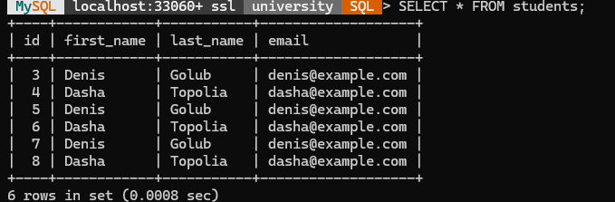

# Реалізація об’єктно-реляційного відображення

У цьому документі показано, як реалізувати патерн DAO на прикладі роботи з таблицею `students` у MySQL.

## 1. SQL-скрипт для таблиці `students`

*Пояснення:* цей SQL-скрипт створює базу даних `university_db` та таблицю `students`, яка містить три поля: 
- `id` — унікальний автоінкрементний ідентифікатор студента, 
- `name` — ім'я студента, 
- `email` — електронна пошта.

```sql
CREATE DATABASE university;
USE university;

CREATE TABLECREATE TABLE students (
     id INT AUTO_INCREMENT PRIMARY KEY,
     first_name VARCHAR(100) NOT NULL,
     last_name VARCHAR(100) NOT NULL,
     email VARCHAR(100) NOT NULL)


```
## Структура проєкту
university/
├── lib/
│   └── mysql-connector-j-9.3.0.jar
├── src/
   └── main/
       └── java/
           └── com/
               └── example/
                   ├── dao/
                   │   ├── StudentDAO.java
                   │   └── StudentDAOImpl.java
                   ├── model/
                   │   └── Student.java
                   ├── util/
                   │   └── DatabaseConnection.java
                   └── TestDAO.java

## 2. DatabaseConnection.java

*Пояснення:* клас `DatabaseConnection` відповідає за встановлення з'єднання з MySQL. Використовується JDBC-URL, ім'я користувача та пароль. Метод `getConnection()` повертає активний `Connection`, який далі передається DAO.

```java
package com.example.util;

import java.sql.Connection;
import java.sql.DriverManager;
import java.sql.SQLException;

public class DatabaseConnection {

    private static final String URL = "jdbc:mysql://localhost:3306/university";
    private static final String USER = "root";
    private static final String PASSWORD = "pswrd";

    public static Connection getConnection() throws SQLException {
        try {
            // Завантажуємо драйвер MySQL
            Class.forName("com.mysql.cj.jdbc.Driver");
            return DriverManager.getConnection(URL, USER, PASSWORD);
        } catch (ClassNotFoundException e) {
            e.printStackTrace();
            throw new SQLException("MySQL JDBC Driver not found", e);
        }
    }
}
```

## 3. Student.java

*Пояснення:* це POJO-клас (bean), що відображає структуру таблиці `students`. Містить поля `id`, `name`, `email`, геттери та сеттери, а також метод `toString()` для зручного виводу об’єкта.

```java
package com.example.model;

public class Student {
    private int id;
    private String firstName;
    private String lastName;
    private String email;

    public Student() {}

    public Student(String firstName, String lastName, String email) {
        this.firstName = firstName;
        this.lastName = lastName;
        this.email = email;
    }

    public int getId() { return id; }
    public void setId(int id) { this.id = id; }

    public String getFirstName() { return firstName; }
    public void setFirstName(String firstName) { this.firstName = firstName; }

    public String getLastName() { return lastName; }
    public void setLastName(String lastName) { this.lastName = lastName; }

    public String getEmail() { return email; }
    public void setEmail(String email) { this.email = email; }
}
```

## 4. StudentDAO.java (інтерфейс)

*Пояснення:* інтерфейс DAO визначає контракти для роботи з `Student` у базі даних. Тут наведено методи для вставки нового студента та пошуку за іменем.

```java
package com.example.dao;

import com.example.model.Student;
import java.util.List;

public interface StudentDAO {
    void addStudent(Student student);
    Student getStudent(int id);
    List<Student> getAllStudents();
    void updateStudent(Student student);
    void deleteStudent(int id);
}
```

## 5. StudentDAOImpl.java

*Пояснення:* реалізація інтерфейсу `StudentDAO`. У методі `insert` використовується `PreparedStatement` з опцією `RETURN_GENERATED_KEYS`, щоб отримати згенерований базою `id`. У методі `findByName` виконується запит з параметром `name`, результати якого перетворюються на список об’єктів `Student`.

```java
package com.example.dao;

import com.example.model.Student;

import java.sql.*;
import java.util.ArrayList;
import java.util.List;

public class StudentDAOImpl implements StudentDAO {
    private Connection connection;

    public StudentDAOImpl(Connection connection) {
        this.connection = connection;
    }

    @Override
    public void addStudent(Student student) {
        String query = "INSERT INTO students (first_name, last_name, email) VALUES (?, ?, ?)";
        try (PreparedStatement stmt = connection.prepareStatement(query)) {
            stmt.setString(1, student.getFirstName());
            stmt.setString(2, student.getLastName());
            stmt.setString(3, student.getEmail());
            stmt.executeUpdate();
        } catch (SQLException e) {
            e.printStackTrace();
        }
    }

    @Override
    public Student getStudent(int id) {
        String query = "SELECT * FROM students WHERE id = ?";
        try (PreparedStatement stmt = connection.prepareStatement(query)) {
            stmt.setInt(1, id);
            ResultSet rs = stmt.executeQuery();
            if (rs.next()) {
                Student student = new Student();
                student.setId(rs.getInt("id"));
                student.setFirstName(rs.getString("first_name"));
                student.setLastName(rs.getString("last_name"));
                student.setEmail(rs.getString("email"));
                return student;
            }
        } catch (SQLException e) {
            e.printStackTrace();
        }
        return null;
    }

    @Override
    public List<Student> getAllStudents() {
        List<Student> students = new ArrayList<>();
        String query = "SELECT * FROM students";
        try (Statement stmt = connection.createStatement()) {
            ResultSet rs = stmt.executeQuery(query);
            while (rs.next()) {
                Student student = new Student();
                student.setId(rs.getInt("id"));
                student.setFirstName(rs.getString("first_name"));
                student.setLastName(rs.getString("last_name"));
                student.setEmail(rs.getString("email"));
                students.add(student);
            }
        } catch (SQLException e) {
            e.printStackTrace();
        }
        return students;
    }

    @Override
    public void updateStudent(Student student) {
        String query = "UPDATE students SET first_name = ?, last_name = ?, email = ? WHERE id = ?";
        try (PreparedStatement stmt = connection.prepareStatement(query)) {
            stmt.setString(1, student.getFirstName());
            stmt.setString(2, student.getLastName());
            stmt.setString(3, student.getEmail());
            stmt.setInt(4, student.getId());
            stmt.executeUpdate();
        } catch (SQLException e) {
            e.printStackTrace();
        }
    }

    @Override
    public void deleteStudent(int id) {
        String query = "DELETE FROM students WHERE id = ?";
        try (PreparedStatement stmt = connection.prepareStatement(query)) {
            stmt.setInt(1, id);
            stmt.executeUpdate();
        } catch (SQLException e) {
            e.printStackTrace();
        }
    }
}
```

## 6. TestDAO.java

*Пояснення:* тестовий клас, який демонструє використання DAO. Спочатку встановлює з'єднання, далі створює два об’єкти `Student` та вставляє їх у базу. Потім виконує пошук по імені та виводить результати в консоль.

```java
package com.example;

import com.example.dao.StudentDAO;
import com.example.dao.StudentDAOImpl;
import com.example.model.Student;
import com.example.util.DatabaseConnection;

import java.sql.Connection;
import java.sql.SQLException;
import java.util.List;

public class TestDAO {

    public static void main(String[] args) {
        try (Connection connection = DatabaseConnection.getConnection()) {
            StudentDAO studentDAO = new StudentDAOImpl(connection);

            // Додавання студентів
            studentDAO.addStudent(new Student("Denis", "Golub", "denis@example.com"));
            studentDAO.addStudent(new Student("Dasha", "Topolia", "dasha@example.com"));

            // Отримання студента
            Student student = studentDAO.getStudent(1);
            System.out.println("Student: " + student.getFirstName() + " " + student.getLastName());

            // Оновлення студента
            student.setFirstName("Denis");
            studentDAO.updateStudent(student);

            // Отримання всіх студентів
            List<Student> students = studentDAO.getAllStudents();
            for (Student s : students) {
                System.out.println(s.getFirstName() + " " + s.getLastName());
            }

            // Видалення студента
            studentDAO.deleteStudent(2);
        } catch (SQLException e) {
            e.printStackTrace();
        }
    }
}
```

## 7. Компіляція та запуск

*Пояснення:* команда `javac` компілює всі необхідні класи, вказуючи JAR-конектор MySQL у classpath. Команда `java` запускає клас `TestDAO`, передаючи той же classpath, що й при компіляції.

```bash
# Компіляція:
javac -cp "lib/mysql-connector-j-9.3.0.jar"   src/main/java/com/example/util/DatabaseConnection.java   src/main/java/com/example/model/Student.java   src/main/java/com/example/dao/StudentDAO.java   src/main/java/com/example/dao/StudentDAOImpl.java   src/main/java/com/example/TestDAO.java

# Запуск:
java -cp "lib/mysql-connector-j-9.3.0.jar:src/main/java" com.example.TestDAO
```
# Результат:



## 8. Висновок

* Реалізовано архітектурний патерн **DAO (Data Access Object)** для роботи з таблицею `students` у базі MySQL.  
* Створено базу даних `university` та таблицю `students` з полями `id`, `name` і `email`.  
* Розроблено POJO-модель `Student`, що відображає структуру цієї таблиці.  
* Описано інтерфейс `StudentDAO` та його реалізацію `StudentDAOImpl` з методами `insert` (вставка) і `findByName` (пошук за іменем).  
* Проведено тестування через клас `TestDAO`: додано реальні записи та виконано пошук за ім’ям.  
* Програма успішно вставляє та читає дані з бази, що підтверджує коректність реалізації патерна DAO.

